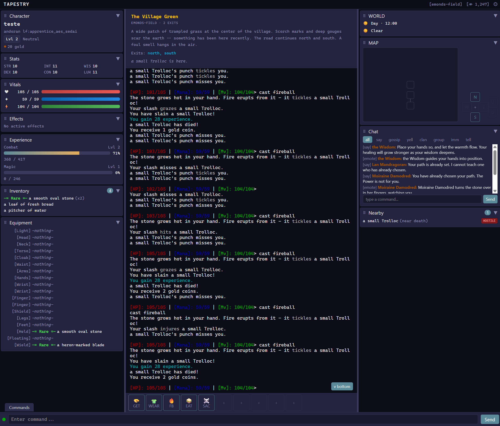
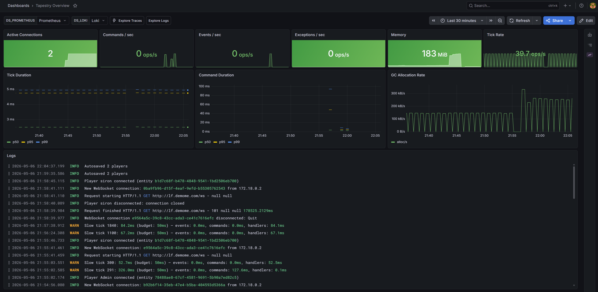
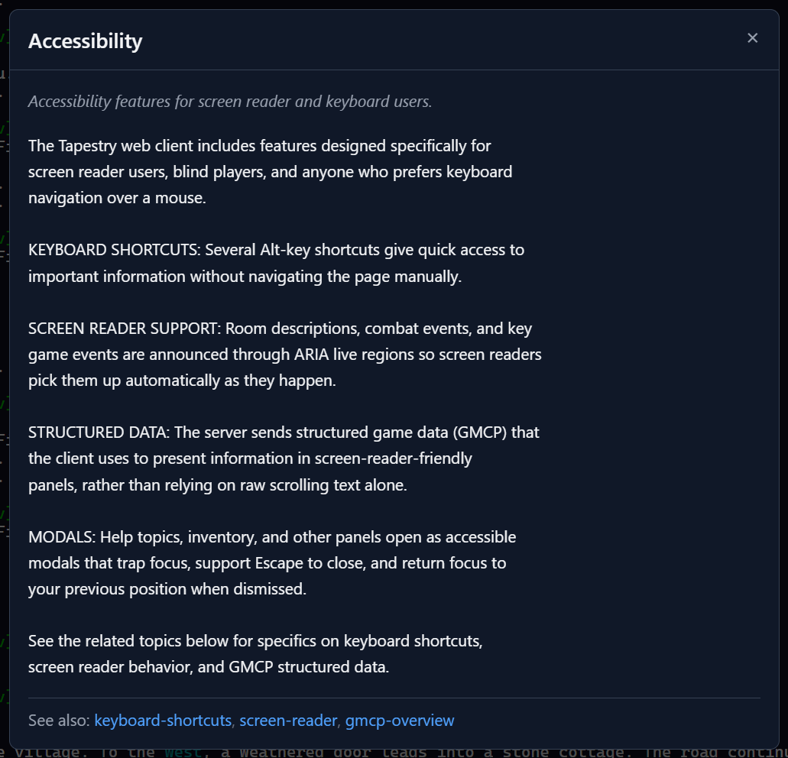
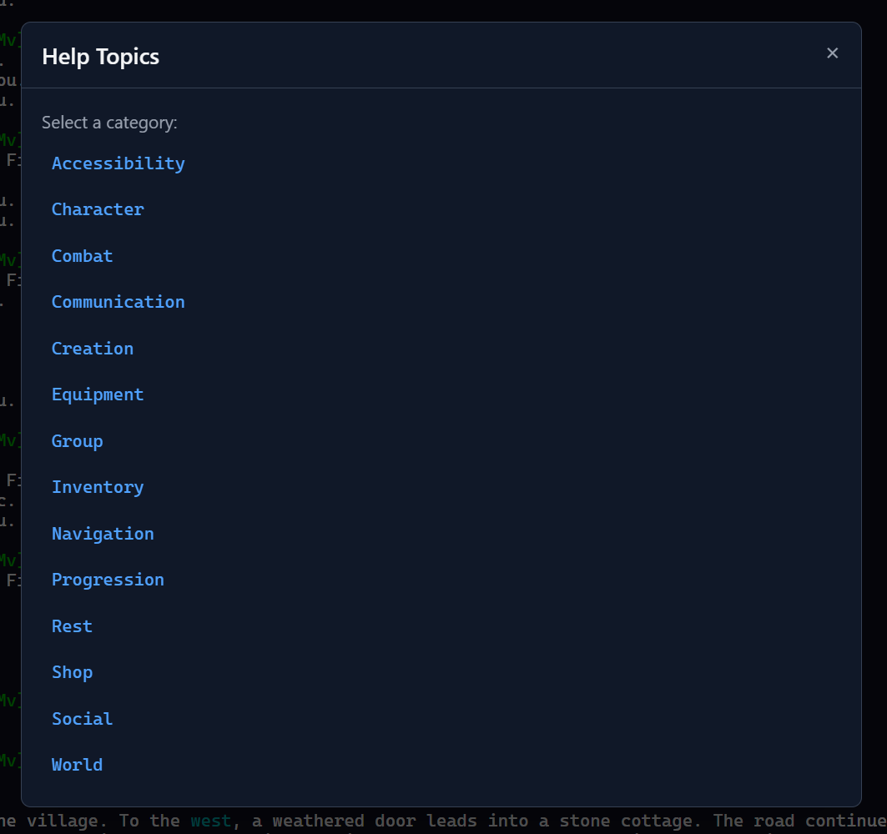
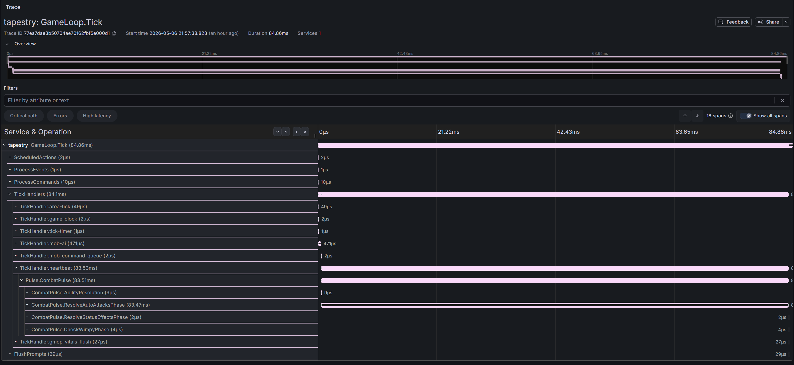

# Tapestry

[](https://discord.gg/YQtbBqZ69J)

A modular MUD engine where the engine ships plumbing and packs ship the game.

Rooms, NPCs, quests, shops, items, branching quest chains -- all YAML config files. If you can write a config file, you can build a MUD. JavaScript is available for event-driven behavior (NPC reactions, custom commands, quest lifecycle hooks), but most worlds never need it.

Every pack you build can be published to the registry and installed by any Tapestry server. The registry is how the community shares work.

**Live demo:** [lf.tapestryengine.com](https://lf.tapestryengine.com) -- Legends Forgotten, a Wheel of Time-inspired MUD built entirely from Tapestry packs.

---

## Screenshots

<a href="screenshots/web-client.png"></a>

<a href="screenshots/grafana-dashboard.png"></a>

<a href="screenshots/accessibility.png"></a>

<a href="screenshots/help-system.png"></a>

<a href="screenshots/jaeger-tracing.png"></a>

---

## Quick Start

Requires [Docker](https://www.docker.com/) and the [Tapestry CLI](https://github.com/tapestry-mud/tapestry-cli):

```bash
npm install -g @tapestry-mud/cli

tapestry init       # scaffold a project from the starter preset
tapestry install    # download packs from the registry
tapestry start      # pull the engine image and boot
```

Connect with `telnet localhost 4000` or open the [web client](https://github.com/tapestry-mud/tapestry-client) in a browser.

---

## Building a Game with YAML

The pack system is the core idea. The engine provides systems; packs provide content. Here is what that looks like in practice:

**A room:**
```yaml
id: "mygame:village-square"
name: "Village Square"
description: "Market stalls line the cobblestones. Smoke rises from the smithy to the north."
exits:
  north: "mygame:smithy"
  south: "mygame:inn"
properties:
  terrain: urban
spawns:
  - mob: "mygame:merchant"
    count: 2
    max: 4
```

**A quest with branching paths:**
```yaml
id: "mygame:first-mission"
name: "Prove Your Worth"
giver: "mygame:guild-master"
stages:
  - id: hunt
    objectives:
      - type: kill
        target: "mygame:goblin"
        count: 5
  - id: return
    objectives:
      - type: visit
        target: "mygame:guildhall"
rewards:
  xp: 200
  gold: 50
```

**A hostile NPC with loot:**
```yaml
id: "mygame:goblin"
name: "a cave goblin"
base_disposition: hostile
behavior: aggro
stats:
  strength: 8
  max_hp: 20
battle_commands:
  - "emote snarls and lunges."
  - kick
properties:
  mob_level: 2
  xp_value: 40
loot:
  pool:
    - item: "mygame:rusty-dagger"
      weight: 80
```

For behavior that goes beyond configuration -- NPC dialogue triggered by quest completion, custom combat abilities, character initialization -- JavaScript event hooks are available. See the [official packs](https://github.com/tapestry-mud/tapestry-packs) for working examples.

---

## What's in the Engine

**World:** Rooms with directional and keyword exits, doors (lock/pick/key), temporary portals, weather zones, day/night cycle, area resets, spawn tables with rare spawn weighting.

**Entities:** Unified entity model with tags and dynamic properties. Stats with equipment modifiers, weight-based inventory, multi-slot equipment. Containers, consumables (eat/drink/quaff/recite), rest/sleep with regen multipliers.

**Combat:** D20 hit resolution, 4-type AC (slash/pierce/bash/exotic), 20-tier damage verb scaling, death with corpse/loot, flee, wimpy, alignment shifts.

**Progression:** XP tracks with configurable formulas, death penalty, level-up callbacks. Proficiency tiers (Novice through Master). Trainer NPCs, class paths with auto-grant on level-up, stat training.

**Social:** Say/yell/emote, communication channels, groups (follow/invite/kick/promote), XP and gold sharing, rescue, group chat.

**Character creation:** Step-based wizard with ANSI panels, race/class/alignment selection with per-option lore text, pack-defined creation options.

**NPCs:** Wander/patrol/stationary AI, aggro, flee threshold, shop system (buy/sell/list), idle behavior, skill trainers.

---

## Pack System

Packs are the unit of extension for everything -- content and systems alike.

A pack can be a world (areas, NPCs, quests), a system (crafting, economy, an enhanced quest engine, a skill tree), or both. System packs register their own tags and properties with the engine; content packs declare a dependency and use them. The CLI resolves the dependency graph and installs everything in the right order.

This means the ecosystem can grow independently of the engine. Someone publishes a crafting system pack. A world builder depends on it and uses `craftable: true` in their item YAML. No engine changes, no C#.

A pack contains:

| File type | Purpose |
|-----------|---------|
| `tapestry.yaml` | Manifest -- name, version, engine constraint, dependencies, content globs |
| `areas/**/*.yaml` | Rooms, mobs, items, spawn tables |
| `quests/**/*.yaml` | Quest definitions with objectives and rewards |
| `scripts/**/*.js` | System behavior, event hooks, custom commands (optional) |
| `help/**/*.yaml` | In-game help topics (optional) |

Registrations are declarative and resolve at a single seal when the server boots. If two packs
register the same name in the same family (a command, class, emote, equipment slot, ...), the
boot fails with an error naming both source files -- never a silent clobber. The pack that
intends to win declares `override: true` on its registration AND a `dependencies:` entry on the
pack it overrides; engine/kernel registrations are not overridable. This covers commands, mob
commands and behaviors, classes, races, abilities, emotes, flows, progression tracks, quest
hooks, themes, equipment slots, arg types, rarity and essence tiers, help topics, and exports.

See [tapestry-packs](https://github.com/tapestry-mud/tapestry-packs) for the official packs and a reference for how community packs are structured.

---

## Accessibility

Screen reader support is baked into the engine, not bolted on by the client.

Every reaction that would print on screen is also sent through the GMCP feedback channel. That means any pack -- even one built without accessibility in mind -- is automatically readable by a screen reader. Content creators can supply richer structured GMCP channels for a more tailored experience, but the feedback channel guarantees a working floor.

The web client exposes this through ARIA live regions fed by GMCP packets (not terminal scraping -- the terminal is `aria-hidden`). Players configure how aggressively each category of content is announced: Interrupt, Polite, or Off. On-demand keyboard shortcuts let screen reader users request a full room description, nearby entities with action hints, or help text at any time.

The telnet server works with any screen reader out of the box -- plain text over a terminal connection.

See [tapestry-client](https://github.com/tapestry-mud/tapestry-client) for full details on the client-side implementation.

---

## Observability

The engine ships a full OpenTelemetry pipeline. Entirely additive -- the engine runs fine without it.

```bash
docker-compose up -d          # start the observability stack
# set telemetry.enabled: true in server.yaml
tapestry start
```

Open Grafana at `http://localhost:3001` for the pre-provisioned Tapestry Overview dashboard.

| Component | Purpose |
|-----------|---------|
| OTel Collector | Telemetry pipeline hub |
| Loki | Log aggregation |
| Prometheus | Metrics |
| Jaeger | Distributed traces |
| Grafana | Unified UI with pre-provisioned dashboard |

What's instrumented: every game loop tick, per-command execution time, connection lifecycle, slow tick detection, active connections, queue depth.

---

## Architecture

Modular .NET 10 monolith. Zero hardcoded game logic -- everything comes from packs.

```
Tapestry.Shared       Enums, interfaces, shared types
Tapestry.Engine       Entity system, rooms, world graph, event bus, command routing, game loop
Tapestry.Networking   Telnet + WebSocket servers, ANSI color
Tapestry.Scripting    Jint JS runtime, YAML loader, pack loader, JS-to-engine bridge
Tapestry.Data         Server configuration (YAML)
Tapestry.Server       Host startup, DI wiring
```

Key dependencies: [Jint](https://github.com/sebastienros/jint) (embedded ES6+ JS runtime, 37 API modules), [YamlDotNet](https://github.com/aaubry/YamlDotNet), OpenTelemetry .NET SDK.

---

## Engine Development

```bash
dotnet test
dotnet run --project src/Tapestry.Server
```

---

## Status

Pre-v1, actively developed. The engine is stable and running production traffic at [lf.tapestryengine.com](https://lf.tapestryengine.com). Breaking changes may occur before v1.0.

The [issue tracker](https://github.com/tapestry-mud/tapestry/issues) has all planned work, labeled by area (`server`, `client`, `pack`) and difficulty (`good first issue`). To contribute: pick an issue, leave a comment, open a PR against `master`.

---

## Ecosystem

| Repo | Purpose |
|------|---------|
| [tapestry-cli](https://github.com/tapestry-mud/tapestry-cli) | CLI -- init, install, start, publish |
| [tapestry-packs](https://github.com/tapestry-mud/tapestry-packs) | Official content packs |
| [tapestry-client](https://github.com/tapestry-mud/tapestry-client) | React web client |
| [tapestry-registry](https://github.com/tapestry-mud/tapestry-registry) | Registry server |

[tapestryengine.com](https://tapestryengine.com) - [Browse packs](https://tapestryengine.com/packages.html) - [lf.tapestryengine.com](https://lf.tapestryengine.com)

---

## License

[AGPL-3.0](LICENSE) -- use it for anything, run it as a service, but keep your modifications open.
